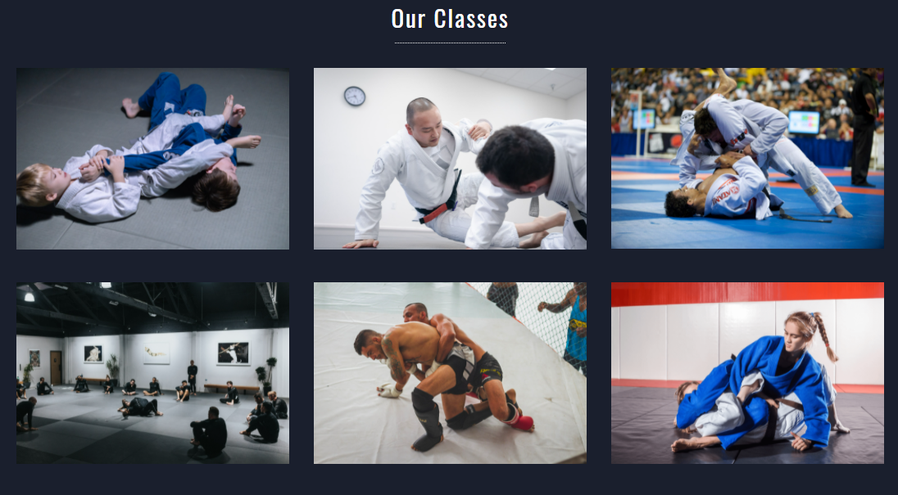
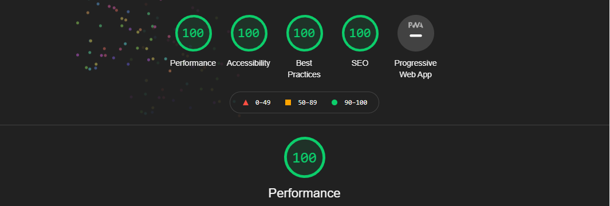

# BJJ - Brazilian Jiu-Jitsu GYM

BJJ - Brazilian Jiu-Jitsu is a website that helps people stay passionate about the Gentle Art - as it is known the practice of Jiu-Jistu - besides introduce this modality to new aspirates who want to know more about the pillars of Brazilian Jiu-Jitsu.  Based in Dublin, Ireland, we offer a friendly and cosy environment, to receive from beginners to more advanced practitioners. The site is targeted toward practisers and athletes who are looking for a way to socialise and keep themselves fit. BJJ will be useful for all people to find out exactly why they should choose practicing jiu-jistu.

The live link can be found <a href="https://emidiovaleretto.github.io/bjj-webapp-ms1-project/" target="_blank" rel="noopener">here</a>.

## Table of Contents
- [BJJ - Brazilian Jiu-Jitsu GYM](#bjj---brazilian-jiu-jitsu-gym)
  - [Table of Contents](#table-of-contents)
- [Features](#features)
  - [Logo](#logo)
  - [Navigation Bar](#navigation-bar)
  - [The main section image](#the-main-section-image)
  - [White Background Divisor](#white-background-divisor)
  - [Our Mission Section](#our-mission-section)
  - [Our Classes Section](#our-classes-section)
  - [Our Packages Section](#our-packages-section)
  - [The Gallery Section](#the-gallery-section)
  - [Where to Find us Section](#where-to-find-us-section)
  - [Form](#form)
  - [Thank you page](#thank-you-page)
  - [Footer](#footer)
  - [Beginners Guide Page](#beginners-guide-page)
- [Features Left to Implement](#features-left-to-implement)
- [Tecnologies Used](#tecnologies-used)
  - [Languages Used](#languages-used)
  - [Frameworks, Liberies and other softwares used](#frameworks-liberies-and-other-softwares-used)
- [Colours Palette](#colours-palette)
- [Testing](#testing)
  - [HTML](#html)
  - [CSS](#css)
- [Deployment](#deployment)
- [Performance and accessibility testing](#performance-and-accessibility-testing)
  - [What is considered as accessibility?](#what-is-considered-as-accessibility)
- [Credits](#credits)
  - [Our Classes images](#our-classes-images)
  - [Gallery images](#gallery-images)
- [Acknowledgements](#acknowledgements)

# Features

 ## Logo
  - The logo is creation of the designer Teresa Antunes. Visit Teresa's Portfolio by clicking <a href="https://www.terezaantunes.com/" target="_blank" rel="noopener">here!</a>

 ## Navigation Bar
  - Featured with five sections, the full responsive bar includes links to the Logo, Home page, Our Mission, Our Classes, Our Packages, Gallery and Get Started.
    
  - This section will allow the user to easily navigate through the landing page across all devices. Upon clicking, the user is directed to the corresponding section via a scroll-down.

## The main section image
  - The main section includes a photography of two jiu-jitsu practitioners with a text overlay to allow the user to see exactly which location this site would be applicable to.
  - This section introduces the user to Brazilian Jiu Jitsu with an emblematic image of the practitioners to draw their attention, in addition to two buttons with very expressive colours that will arouse curiosity to explore the page even further.

## White Background Divisor
  - A white background divider is used to draw a custom bar to divide the main section into the next.

## Our Mission Section
  - The Our Mission section will allow the user to know about the establishment's mission, including what are the fundamental principles of good practice in jiu-jitu, in addition to rules of conduct as well as the benefits of joining the Brazilian Jiu-Jitsu overall.
  - Right below, the user can briefly know the history of Derek, responsible for the Brazilian jiu-jitsu academy in Dublin, Ireland. 

## Our Classes Section
  - The section Our Classes will allow the user to see exactly which classes he/she will have available, being able to choose according to their level in relation to the practice of jiu-jitsu, covering from the most beginner to the most advanced level.

  - This section also includes a text overlay to let the user know which image matches which lesson modality in particular.

## Our Packages Section
  - The section Our Packages serves to show the user which packages are available and what is included in each one, giving the practitioner complete freedom to choose which package best to please.

## The Gallery Section
  - The Gallery section, as its name suggests, is a photo gallery that exposes the user to images of Brazilian Jiu-Jitsu practitioners, in order to sharpen the user's imagination so that he can have a better idea of ​​what this martial art is.

## Where to Find us Section
  - The section Where to Find us serves to guide the user where they can find us, including a contact number, an email address and not less important a opening hours timetable. Right below there is a map giving the directions to our facilities.

## Form
  - The Form section is where the user can interact with us. The form is used so that the user can demonstrate their interest in getting to know the facilities of the academy, learn more about what Brazilian Jiu-Jitsu is about and, finally, schedule an introductory class so that they can see some basic concepts in practice. about the modality.

## Thank you page
  - Right after submitting the form, the user will be able to see a thank you page and a message that we will contact you shortly.

## Footer
  - The footer section includes a link to the Github page for this project. The link will open to a new tab to allow easy navigation for the user.
  - Also, the footer section includes a button "back to top" to facilitate the user to go back to the top of the page without needing to scroll back all the way up.

## Beginners Guide Page
  - The beginners guide page is linked to the button in the main section that redirects the user to another page containing a YouTube video with some examples of the main techniques that every beginner will find. 

# Features Left to Implement
  - A student testimonial session.

# Tecnologies Used

## Languages Used

   - <a href="http://en.wikipedia.org/wiki/html" target="_blank">HTML5</a>
   - <a href="https://en.wikipedia.org/wiki/CSS" target="_blank">CSS3</a>

## Frameworks, Liberies and other softwares used

   - <a href="https://fonts.google.com" target="_blank">Google Fonts</a>
     - Google Fonts was used to import the fonts Montserrat and Oswald into the style.css file. These fonts were used throughout the site.

   - <a href="https://fontawesome.com/" target="_blank">Font Awesome</a>
     - Font Awesome was used throughout all pages to add icons in order to create a better visual experience for UX purposes.

   - <a href="https://fonts.google.com" target="_blank">GitPod</a>
     - GitPod was used for writing code, committing, and then pushing to GitHub.
  
   - <a href="https://github.com" target="_blank">GitHub</a>
     - GitHub was used to store the project after pushing.

   - <a href="http://ami.responsivedesign.is/" target="_blank">Am I Responsive?</a>
     - Am I Responsive was used in order to see responsive design throughout the process and to generate mockup imagery to be used.
  
   - <a href="https://validator.w3.org/" target="_blank">W3C Markup Validator</a>
     - W3C Markup Validator was used to validate the HTML code.
  
   - <a href="https://jigsaw.w3.org/css-validator/" target="_blank">W3C CSS Validator</a>
     - W3C CSS Validator was used to validate the CSS code.

# Colours Palette

The site's colors palette was thought in the colors used in jiu-jitsu, with white, blue, red and black as primary colors. In addition, other shades of blue and red were chosen to provide a contrast.

 `#FFFFFF --white`  `#FF0000 --red`  `#8b0000 --darkred`  `#610303 --marron`   `#565656 --darkgray`  `#0E34A0 --blue`  `#1a1f2d --darkblue`  `#000000 --black`

# Testing

 ## HTML
  - No errors were returned when passing through the official <a href="http://https://validator.w3.org/#validate_by_input" target="_blank" rel="noopener">W3C Validator</a>

  

  ## CSS
  - No errors were returned when passing through the official <a href="http://https://jigsaw.w3.org/css-validator/#validate_by_input" target="_blank" rel="noopener">(Jigsaw) CSS Validator</a>

    

# Deployment

I deployed the page on GitHub pages via the following procedure: -

1. From the project's [repository](https://github.com/emidiovaleretto/bjj-webapp-ms1-project), go to the **Settings** tab.
2. From the left-hand menu, select the **Pages** tab.
3. Under the **Source** section, select the **Main** branch from the drop-down menu and click **Save**.
4. A message will be displayed to indicate a successful deployment to GitHub pages and provide the live link.
5. The live link can be found here - <a href="https://emidiovaleretto.github.io/bjj-webapp-ms1-project/" target="_blank" rel="noopener">https://emidiovaleretto.github.io/bjj-webapp-ms1-project/</a>.

# Performance and accessibility testing

## What is considered as accessibility?

 - Accessibility is <strong>the practice of making your websites usable by as many people as possible</strong>.
 - We traditionally think of this as being about people with disabilities, but the practice of making sites      accessible also benefits other groups such as those using mobile devices, or those with slow network connections.
  
      - <em>Source: </em><a href="https://developer.mozilla.org/en-US/docs/Learn/Accessibility/What_is_accessibility"><b>MDN Web Docs</b></a>
  
- Accessibility and web performance are not features, they are the <strong>baseline</strong>!

# Credits

All images used in the construction of this project were extracted from sites with a license for use and their respective authors are mentioned below.

## Our Classes images

Kids BJJ - Photo by cottonbro from Pexels 
Form Cover - Photo by <a href="https://unsplash.com/@timothyeberly?utm_source=unsplash&utm_medium=referral&utm_content=creditCopyText" target="_blank" rel="noopener">Timothy Eberly</a> on <a href="https://unsplash.com/s/photos/jiu-jitsu?utm_source=unsplash&utm_medium=referral&utm_content=creditCopyText" target="_blank" rel="noopener">Unsplash</a> 
Advanced BJJ - Photo by <a href="https://unsplash.com/@felipesimo?utm_source=unsplash&utm_medium=referral&utm_content=creditCopyText" target="_blank" rel="noopener">Felipe Simo</a> on <a href="https://unsplash.com/s/photos/jiu-jitsu?utm_source=unsplash&utm_medium=referral&utm_content=creditCopyText" target="_blank" rel="noopener">Unsplash</a> 
Beginner BJJ - Photo by <a href="https://unsplash.com/@richbustos?utm_source=unsplash&utm_medium=referral&utm_content=creditCopyText" target="_blank" rel="noopener">Richard Bustos</a> on <a href="https://unsplash.com/s/photos/jiu-jitsu?utm_source=unsplash&utm_medium=referral&utm_content=creditCopyText" target="_blank" rel="noopener">Unsplash</a> 
MMA BJJ - Photo by Bruno Bueno from Pexels 
No-GI - Photo by <a href="https://unsplash.com/@nate_dumlao?utm_source=unsplash&utm_medium=referral&utm_content=creditCopyText" target="_blank" rel="noopener">Nathan Dumlao</a> on <a href="https://unsplash.com/s/photos/jiu-jitsu?utm_source=unsplash&utm_medium=referral&utm_content=creditCopyText" target="_blank" rel="noopener">Unsplash</a> 
Women's Only Class - <a href="https://jiujitsu-news.com/" target="_blank" rel="noopener">Jiu-Jitsu News</a> 
Main Picture - Photo by <a href="https://pixabay.com/users/gregorycosta-260339/?utm_source=link-attribution&amp;utm_medium=referral&amp;utm_campaign=image&amp;utm_content=2957075" target="_blank" rel="noopener">gregorycosta</a> from <a href="https://pixabay.com/?utm_source=link-attribution&amp;utm_medium=referral&amp;utm_campaign=image&amp;utm_content=2957075" target="_blank" rel="noopener">Pixabay</a> 

## Gallery images

Photo by <a href="https://unsplash.com/@jonathanborba?utm_source=unsplash&utm_medium=referral&utm_content=creditCopyText" target="_blank" rel="noopener">Jonathan Borba</a> on <a href="https://unsplash.com/s/photos/jiu-jitsu?utm_source=unsplash&utm_medium=referral&utm_content=creditCopyText" target="_blank" rel="noopener">Unsplash</a> 
Photo by <a href="https://unsplash.com/@jonathanborba?utm_source=unsplash&utm_medium=referral&utm_content=creditCopyText" target="_blank" rel="noopener">Jonathan Borba</a> on <a href="https://unsplash.com/s/photos/jiu-jitsu?utm_source=unsplash&utm_medium=referral&utm_content=creditCopyText" target="_blank" rel="noopener">Unsplash</a> 
Photo by <a href="https://unsplash.com/@timothyeberly?utm_source=unsplash&utm_medium=referral&utm_content=creditCopyText" target="_blank" rel="noopener">Timothy Eberly</a> on <a href="https://unsplash.com/s/photos/jiu-jitsu?utm_source=unsplash&utm_medium=referral&utm_content=creditCopyText" target="_blank" rel="noopener">Unsplash</a> 
Photo by cottonbro on Pexels 
Image by <a href="https://pixabay.com/users/mikepesh-3053031/?utm_source=link-attribution&amp;utm_medium=referral&amp;utm_campaign=image&amp;utm_content=1575854" target="_blank" rel="noopener">mikepesh</a> from <a href="https://pixabay.com/?utm_source=link-attribution&amp;utm_medium=referral&amp;utm_campaign=image&amp;utm_content=1575854" target="_blank" rel="noopener">Pixabay</a> 
Photo by <a href="https://unsplash.com/@crotalus?utm_source=unsplash&utm_medium=referral&utm_content=creditCopyText" target="_blank" rel="noopener">Samuel Castro</a> on <a href="https://unsplash.com/s/photos/jiu-jitsu?utm_source=unsplash&utm_medium=referral&utm_content=creditCopyText" target="_blank" rel="noopener">Unsplash</a> 
<a href="https://www.jiujitsutimes.com/bjj-for-women/" target="_blank" rel="noopener">Jiu Jitsu Times</a> 

# Acknowledgements

I would like to take the opportunity to thank:

 - My family, friends and colleagues for their advice, support and help with testing.
 - To my mentor Felipe Alarcon for his feedback, advice, support and, above all, for his patience.
 - All Code Institute Tutors and Community on Slack for the peer reviews and advice.